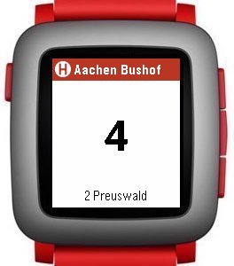

# ACbus

App for the Pebble smartwatch to retrieve ASEAG bus schedules. (ASEAG is the local bus service in Aachen, Germany.)

The original is here: https://github.com/asplendidday/ACbus

I implemented the following changes:

* Made the font larger so it's legible in low-light conditions and/or with less-than-perfect eyesight.
* Starts with list of nearest bus stops.
* Add auto repeat to up/down buttons in bus stop selection.
* Can now select a bus with the up/down buttons.
* Pressing Select in the bus list displays the number of minutes until this bus arrives full-screen ("zoom mode").
* Zoom mode has red background if bus stop is too far away to reach before the bus arrives.
* Don't display seconds since last update all the time. Instead, show an offline message if there was no update for a certain time.
* Between updates (even when offline), estimate bus arrival times based on seconds since last update.
* Change all messages to German.
* Several fixes and optimizations (details in git log).

To install it on your Pebble, open the pbw file in the Pebble app on your phone, or (after intalling the Pebble SDK on your computer) build it from source and use the `pebble install` command.

---
*Wolfram Rösler • wolfram@roesler-ac.de • https://github.com/wolframroesler • https://twitter.com/wolframroesler • https://www.linkedin.com/in/wolframroesler/*
